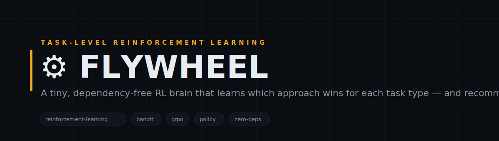
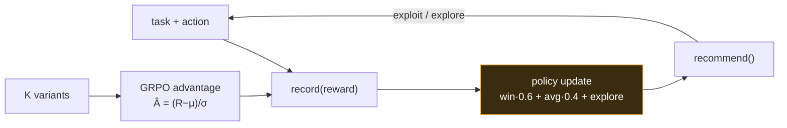

<!-- FLYWHEEL — white-label. No personal or company identifiers in this file by design. -->

<p align="center">
  
</p>

<h1 align="center">⚙️ FLYWHEEL</h1>

<p align="center">
  <b>A tiny, dependency-free RL brain that learns which approach wins for each task type — and recommends the best next move.</b><br>
  <sub>Turn every outcome into a policy update. FLYWHEEL generalizes proven bandit math (win-rate·0.6 + avg-reward·0.4 + exploration + count-decay) from 'which model wins' to 'which action wins for THIS task type', so each thing your agent does biases the next decision. Recall the best past approach; reward outcomes; exploit and explore. Zero dependencies, atomic writes, never throws.</sub>
</p>

<p align="center">

= 18">

</p>

<p align="center">
<code>reinforcement-learning</code> · <code>bandit</code> · <code>grpo</code> · <code>policy</code> · <code>zero-deps</code> · <code>self-improving</code>
</p>

---

## Why FLYWHEEL

Most agents throw away their own results. FLYWHEEL keeps them: it maintains a small on-disk policy that scores each action per task type from real rewards, blends exploitation with principled exploration (UCB-style, plus a nudge to re-sample stale winners), and decays old counts so it stays adaptive. Ask it what to do; tell it how it went; watch it get better. The GRPO group-advantage primitive lets you score K variants tried on the same task, critic-free.

---

## What it does

| Module | What it does | Signal |
|---|---|---|
| **policy brain** | Scores each action per task type from real rewards (win-rate·0.6 + avg·0.4 + explore + decay) | exploit + explore |
| **group-advantage** | Critic-free GRPO normalization  = (R−μ)/σ over K variants tried on one task | pure, deterministic |

---

## Architecture



---

## Quickstart

```bash
# 1. no install needed — pure Node builtins
node lib/group-advantage.cjs      # runs the GRPO self-test

# 2. watch the policy learn from rewards
node examples/demo.cjs

# 3. inspect / drive the brain from the CLI
node lib/flywheel.cjs recommend build react vue svelte
node lib/flywheel.cjs record build react 0.9 "shipped clean"
node lib/flywheel.cjs policy build
```

> State persists to ./data (JSON + append-only JSONL), created on first write and gitignored. Everything is $0, dependency-free, and safe to call in a hot path — it never throws.

---

## Repository layout

```
flywheel/
├── lib/
│   ├── flywheel.cjs         ← the policy brain (record / recommend / policyFor)
│   └── group-advantage.cjs  ← critic-free GRPO advantage (pure math + self-test)
├── examples/
│   └── demo.cjs             ← reward a few actions, watch recommend() shift
└── data/                    ← policy + observation log (gitignored, auto-created)
```

---

## Design principles

1. **Learn from what actually happened.** Every score traces to real rewards you fed it — no hand-tuned priors.
2. **Exploit, but never stop exploring.** Under-sampled and stale actions get a bounded bonus so the policy can't ossify.
3. **Bounded + adaptive.** Counts decay (N-cap) so recent outcomes matter more than ancient ones.
4. **Never throws.** Atomic writes, fail-open reads — safe to call inline in any hot path.

---

<p align="center"><sub>FLYWHEEL · record · reinforce · recommend · MIT</sub></p>
