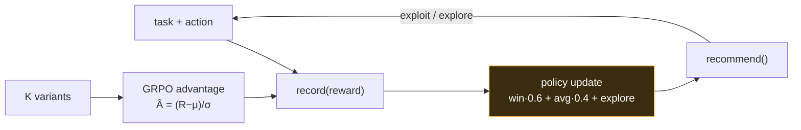

# FLYWHEEL — Architecture

Turn every outcome into a policy update. FLYWHEEL generalizes proven bandit math (win-rate·0.6 + avg-reward·0.4 + exploration + count-decay) from 'which model wins' to 'which action wins for THIS task type', so each thing your agent does biases the next decision. Recall the best past approach; reward outcomes; exploit and explore. Zero dependencies, atomic writes, never throws.

## Flow

## How it fits together

FLYWHEEL is two files. `lib/group-advantage.cjs` is a pure, dependency-free GRPO primitive: given K rewards it returns their critic-free advantages  = (R−μ)/σ (with careful guards so it never emits NaN/Infinity). `lib/flywheel.cjs` is the policy brain: `record(taskType, action, reward)` appends an observation to an append-only JSONL and updates a small JSON policy, scoring each action as win-rate·0.6 + avg-reward·0.4 + an under-sampling exploration term + a nudge to re-sample stale winners; counts decay past an N-cap so the policy stays adaptive. `recommend()` ranks candidate actions (unknowns get a sampling score so they get tried); `recordGroup()` runs K variants of one task through both the absolute-reward policy and the group-relative advantage. All writes are atomic and every path is fail-open — it is safe to call inline in a hot loop.

## Extending it

Every capability is a self-contained module. To add your own, follow the contract the existing
modules use and wire it into the entry point. Keep it portable — config via `.env`, no hardcoded
paths, no personal accounts.

## Design principles

1. **Learn from what actually happened.** Every score traces to real rewards you fed it — no hand-tuned priors.
2. **Exploit, but never stop exploring.** Under-sampled and stale actions get a bounded bonus so the policy can't ossify.
3. **Bounded + adaptive.** Counts decay (N-cap) so recent outcomes matter more than ancient ones.
4. **Never throws.** Atomic writes, fail-open reads — safe to call inline in any hot path.
